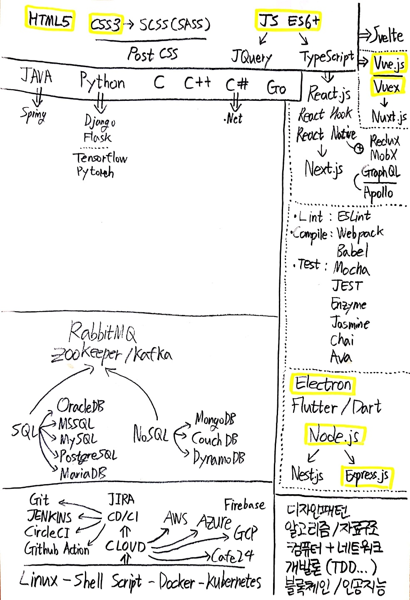

# 2020.03 Trends 정리

     

     

# SSR, CSR

## - SSR (Server Side Rendering)
서버에서 HTML 문서를 보낸다.
 - Server Side Overhead
 - Blinking issue, Non-rich Site interactions
 - Need to wait before interacting

### * TTV (Time to View)

첫 로딩이 걸리는 시간, Viewable

### * TTI(Time to Interact)

interactable에 걸리는 시간

#### Viewable한 시간과 Interactable : SSR은 View가 먼저, CSR은 동시.

## - CSR (Client Side Rendering)
서버에서 JSON을 보낸다.

### * SPA (Single Page Application)
 - React, Vue, Angular
 - 속도가 빠르고, 서버의 부하를 줄이고, 개발을 체계있게 함.
 - JS를 모두 통채로 로드해야되서 첫 로딩이 오래걸린다.
 - 페이지 캐싱이 잘 안된다.
 - SEO(Search Engine Optimization) 최적화가 잘 안된다.
 - PrerenderIO를 이용해서 캐싱과 SEO 문제만 우선적으로 해결할 수 있음.

## - SSG (Static Side Generation)

JS를 통해 HTML 코드를 보낼 수 있음
 - SSG 기능을 이용해 HTML을 보내줌 : 캐싱, SEO, 첫로딩
 - 첫 요청일 때만 SSR. 그 다음은 CSR : Isomorphic APP 양측의 장점을 합치다. --> `NEXT.js`

     

     

# Rendering Histroy

 - 1990년대 중반 : Static Sites
 - 1996년 : 문서 내에서 문서를 담는 iframe
 - 1998년 ~ : XMLHttpRequest
 - 2005년 : XMLHttpRequest --> AJAX : `SPA`
 - CSR : 클라이언트 측에서 다 해먹음
 - SSR : 서버에서 HTML을 다 받고 JS로 동적으로 처리
 - SSG : React로 만든 페이지를 HTML으로 미리 만들어서 정적으로 보내주고 JS 동적으로도 처리
    - React + Gatsby || React + NEXT.js

     

     

# PWA

## - 네이티브 앱

 - 안드로이드 : Java, Kotlin
 - IOS : Objective-C, Swift

성능이 좋음

## - 모바일 웹

 - 스마트폰 및 테블릿에 맞게 웹앱 구성
 - 기능과 성능이 제한됨. 브라우저에 안에서만 돌아감

## - 하이브리드 웹

 - 네이티브로 만들되, 그 앱에 브라우저 창을 둬서 일부 혹은 대부분의 기능을 웹 형태(Web View)로 제공
 - 순수 iOS 혹은 안드로이드를 사용할 수도 있음

## - 크로스-플랫폼 앱

 - 하나의 언어로 IOS와 Android 구현
 - JavaScript : React Native
 - Dart : Flutter
 - C# : Xamarin

## - PWA (Progressive Web Application)

 - 모바일 웹의 한계를 브라우저 발전을 통해 끌어올림
 - 즐겨찾기를 쉽게 제공해 스마트폰 홈 화면에 앱 형태로 제공할 수 있음
 - 마치 네이티브 및 하이브리드 처럼 APP처럼 동작(Uber, Tinder)
 - 당연 고성능은 불가능하지만 브라우저에서 돌리는 것보다 훨씬 편리, 다양한 기능 사용 가능

 